# AGILE

AGILE is an AGI engine written in C#. AGI was the name of the adventure game interpreter used by Sierra On-Line to run the 3D animated adventure games that they released in the 1980s, which included games such as King's Quest 1/2/3/4, Space Quest 1/2, Police Quest, Leisure Suit Larry, Manhunter 1/2, Gold Rush, Donald Duck's Playground, Black Cauldron, and Mixed-Up Mother Goose.

AGILE is an almost complete implementation that has attempted to align as close as possible to the original interpreter's behaviour.

## Features

- Supports PC AGI v2 & v3 games.
- IBM PCJR 4-channel sound, using SN76496 emulation.
- Game detection of most known versions of Sierra's original PC AGI games, and most AGI fan games.
- Command line parameter to integrate with WinAGI.

## Requirements

- .NET Framework 4.8
- Windows 7 or later, 32 bit or 64 bit

## How to run

AGILE starts by looking for a command line parameter. If there is a single command line parameter provided, it will use its value as the directory in which to look for the AGI game to run. If the command line parameter is not provided, then it looks in the current working directory. If it isn't able to find an AGI game in that directory, then it will open a Folder Browser Dialog for you to choose the folder that contains the AGI game.

## Screenshots

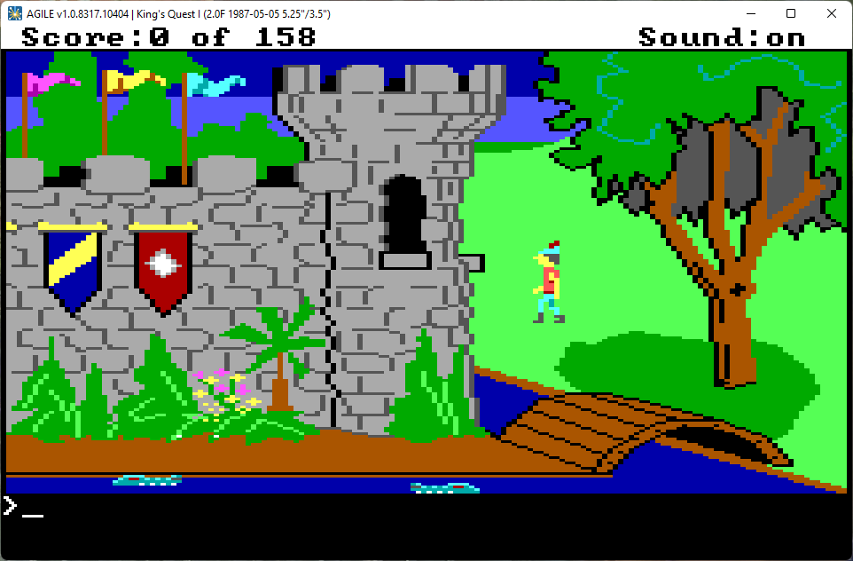           |  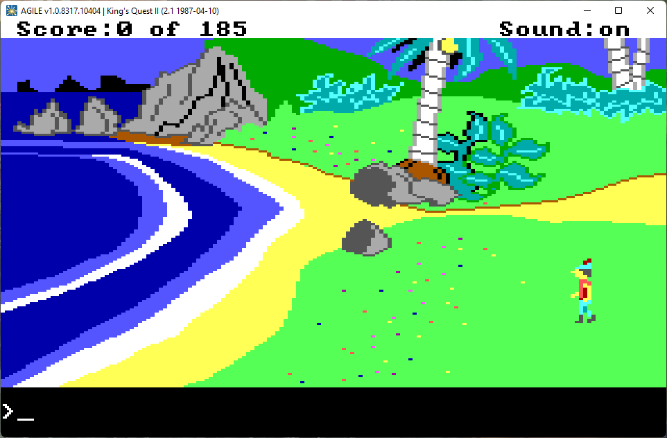
:-------------------------:|:-------------------------:
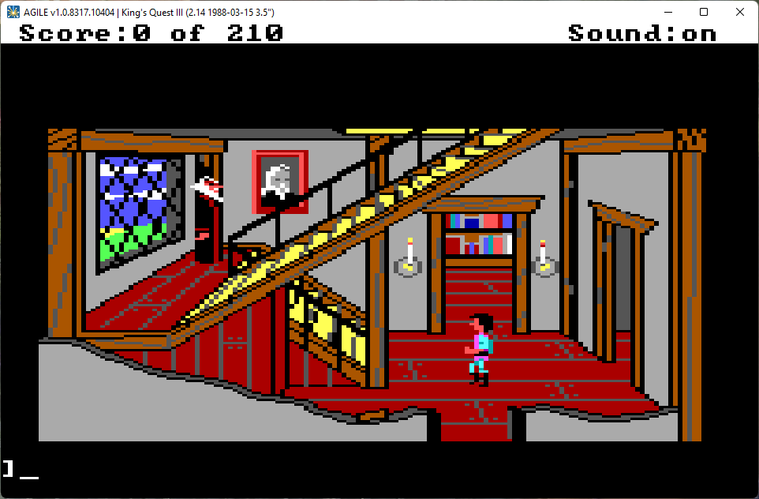  |  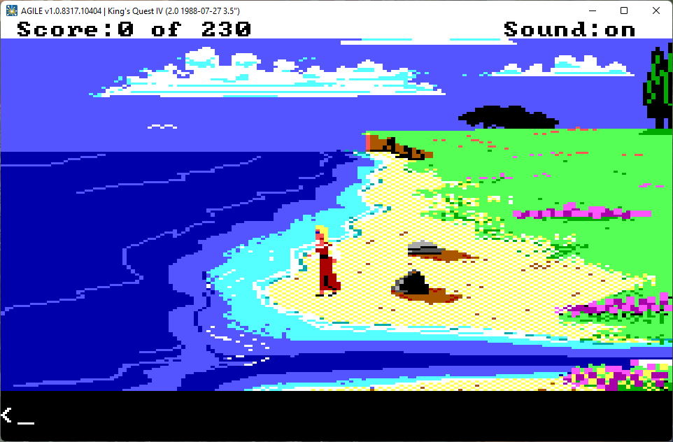
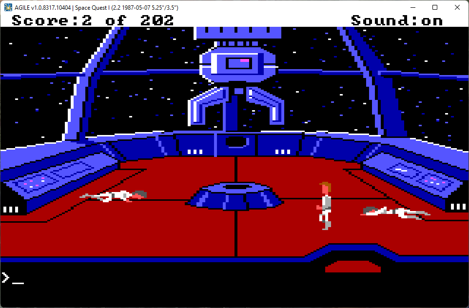     |  
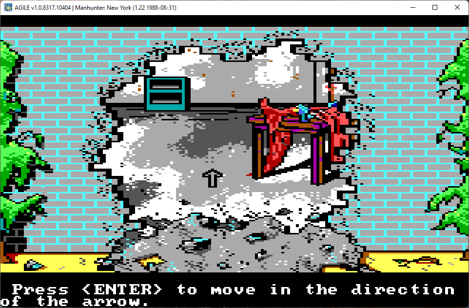     |  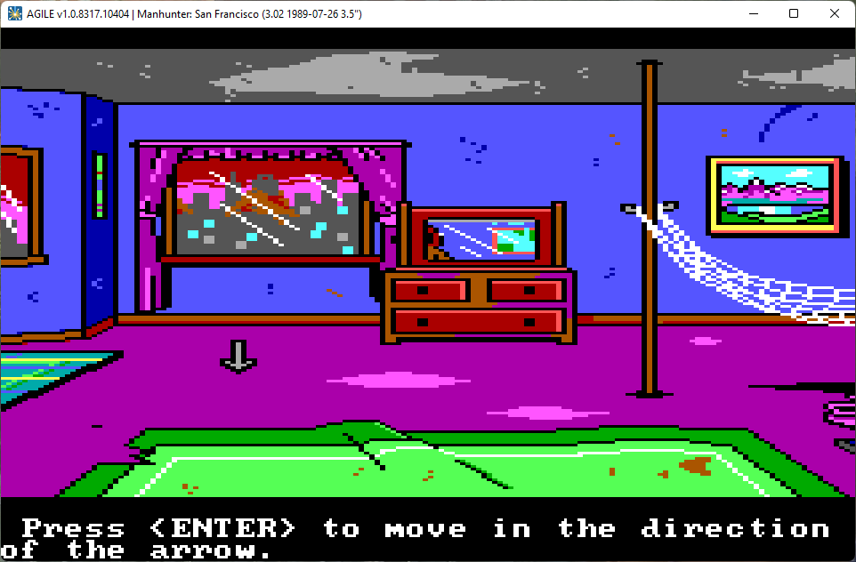
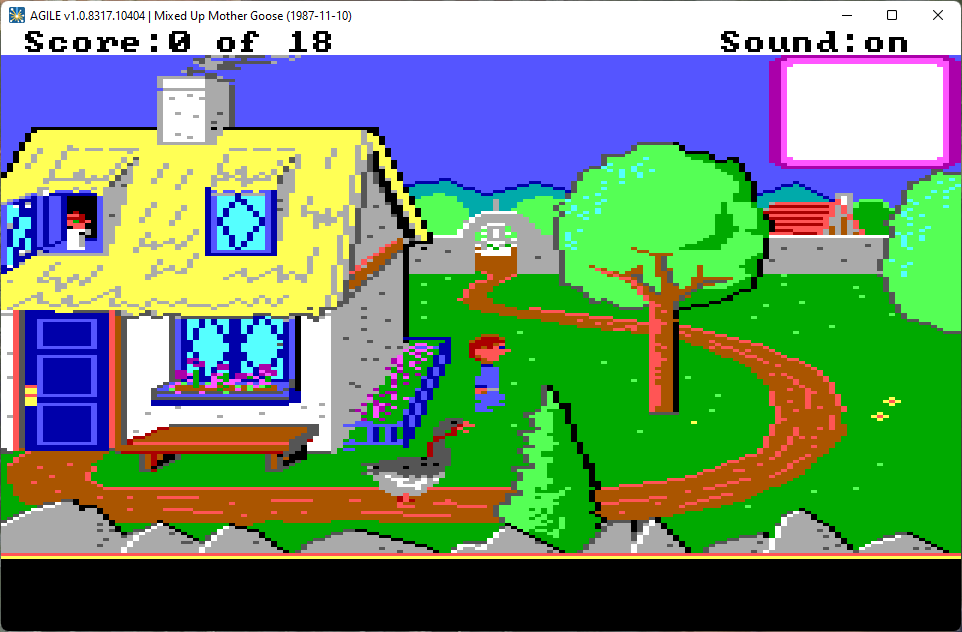     |  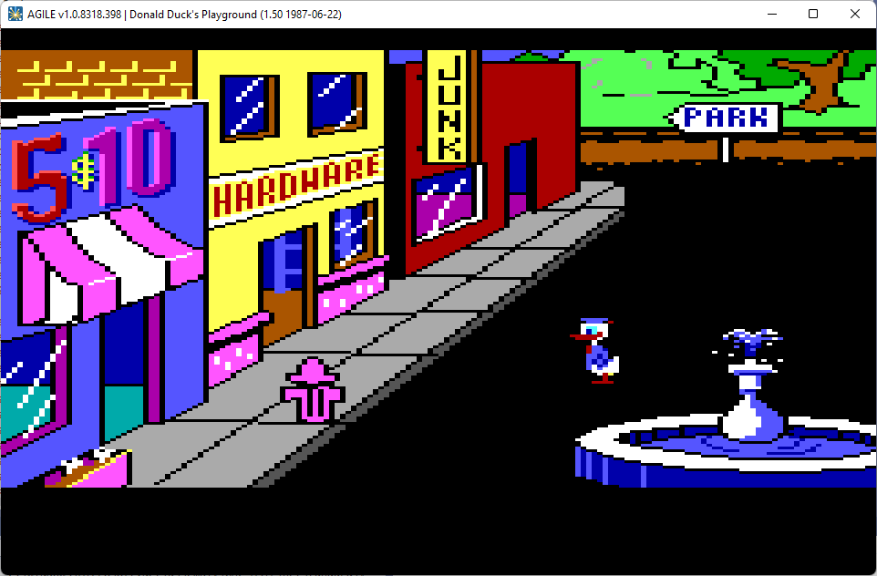
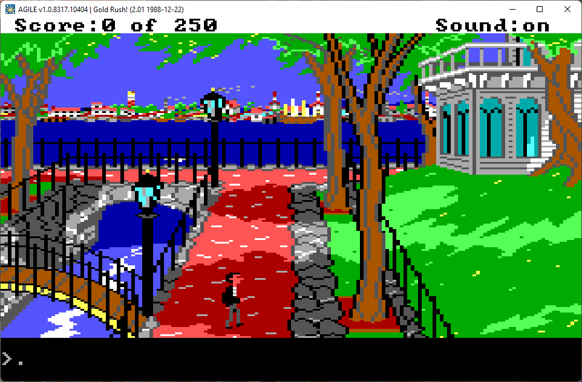     |  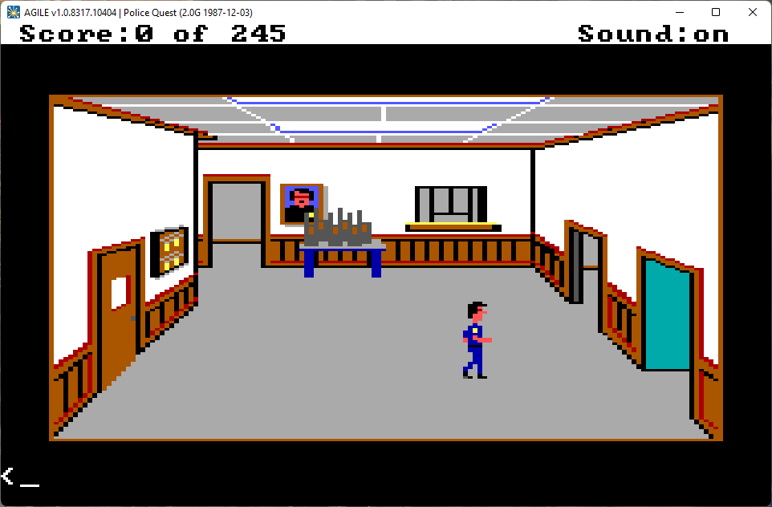
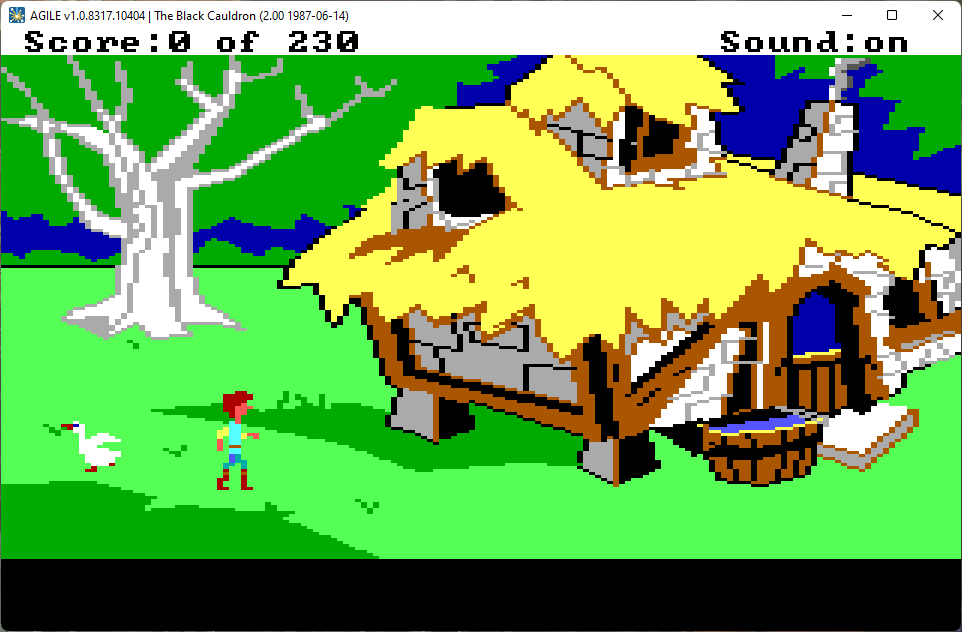     |  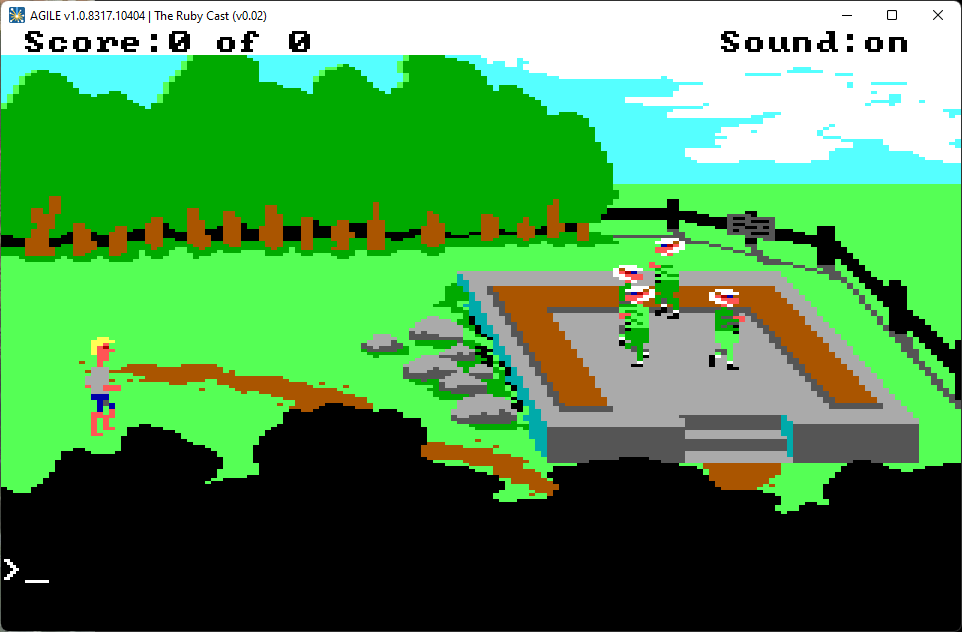

## Credits 

All the source code for the AGILE interpreter itself, as included in this github repo, is written by me (Lance Ewing).

AGILE makes use of an AGILibrary written by various authors, including me, but as the original repo for that is currently private and not mine, the AGILE repo here includes only the compiled DLL for that library. The AGILibrary was originally from the Visual AGI project, which means it began life with Joakim Möller and Gustaf Wennerholm. Others to work on it since then are Andrew Branscom and Jeremiah Nellis. When AGILE began its life in December 2016, the AGILibrary didn't have support for the LOGIC or SOUND resource types, so part of my work included adding support to decode those resource types to the AGILibrary.

## History

Back in the late 1990s, I wrote an AGI interpreter in C called MEKA. This interpreter was nearly complete but was a bit buggy. The functionality of MEKA was based primarily on the AGI specifications that I had helped create, which were based on reverse engineered info. Since then, large portions of Sierra's original AGI interpreter source code have been discovered, in the unused sectors of the original game disks bought by Sierra's customers (SQ2 v2.0D 720K disks). This has shed some light on the inner workings of the interpreter. AGILE has made use of the MEKA source, the AGI specifications, and the original AGI interpreter source code fragments to create something close to accurate.
